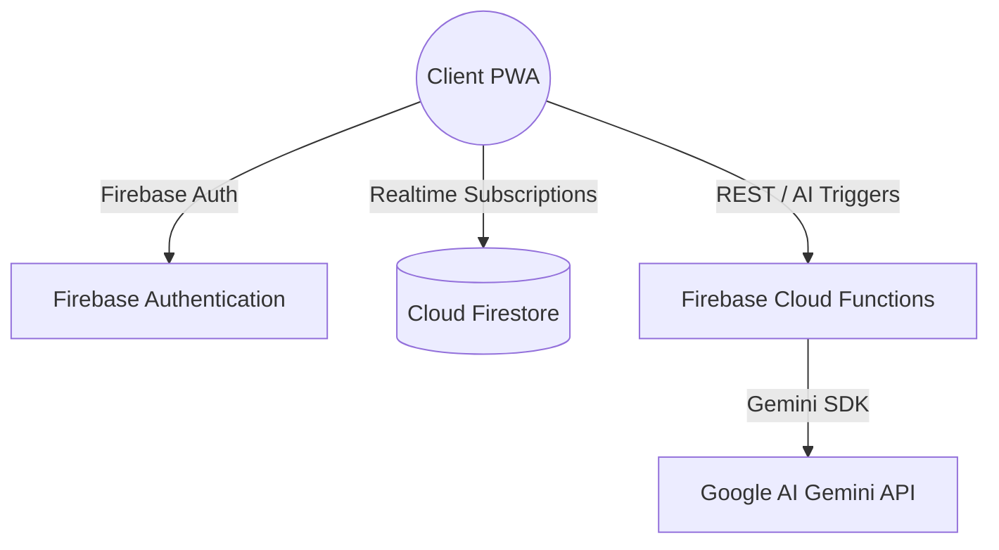

# StadiumIQ System Architecture

This document describes the serverless, decoupled architecture of StadiumIQ.

---

## 1. High-Level Topology

StadiumIQ uses a managed serverless architecture to reduce self-hosted operating costs and scale dynamically to meet the needs of high-concurrency event crowds.

### Key Components:
1. **Frontend Portals (Vercel)**:
   - **Fan Portal (PWA)**: Mobile-optimized client for digital tickets, spatial BLE navigation, waste segregation, and rewards redemptions.
   - **Volunteer Portal**: Operational checklist and incident reporting surface.
   - **Command Center**: Real-time incident analytics and safety alerts dashboard.
2. **Serverless Backing Services (Firebase)**:
   - **Cloud Firestore**: Real-time NoSQL document persistence and sync.
   - **Cloud Functions**: Typescript handlers managing AI chats, incident queries, and pricing simulations.
   - **Firebase Authentication**: Secures write/update requests on all portals.

---

## 2. Spatial Navigation & Positioning
The Fan PWA incorporates a Bluetooth Low Energy (BLE) positioning solver:
* **Distance Solver**: Uses an RSSI path-loss formula to estimate fan distances to beacons.
* **Coordinate Triangulation**: Implements 2D trilateration math equations resolved via Cramer's rule to pinpoint user coordinate maps.

---

## 3. Generative AI Integration
- **RAG Concierge**: Executes prompts using fallback rules for MetLife Stadium bag guidelines, transit station maps, and security options.
- **Security Scopes**: Handled via Cloud Functions, ensuring that Google Gemini API keys are never exposed to client-side bundles.
