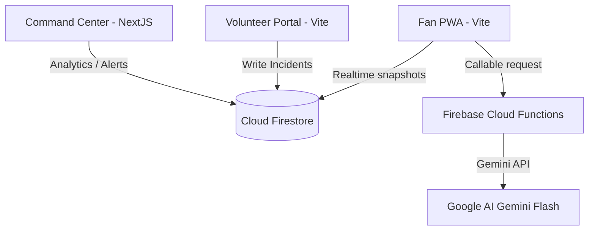
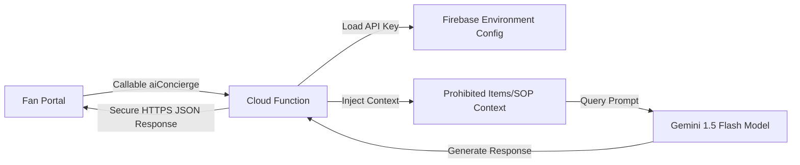
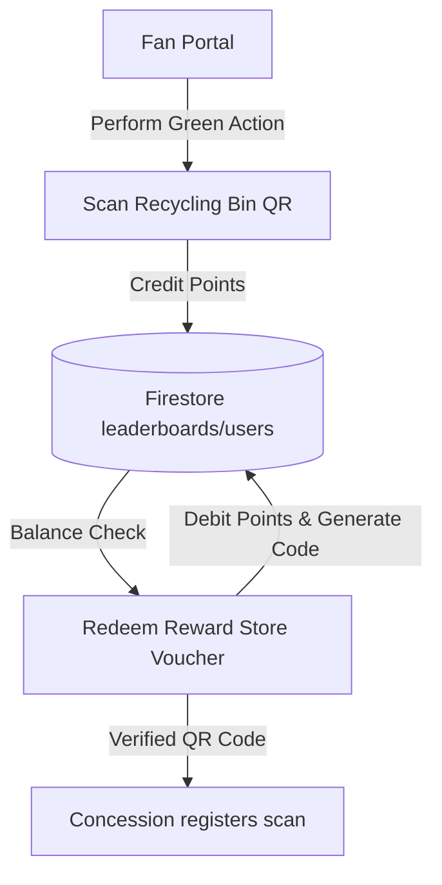
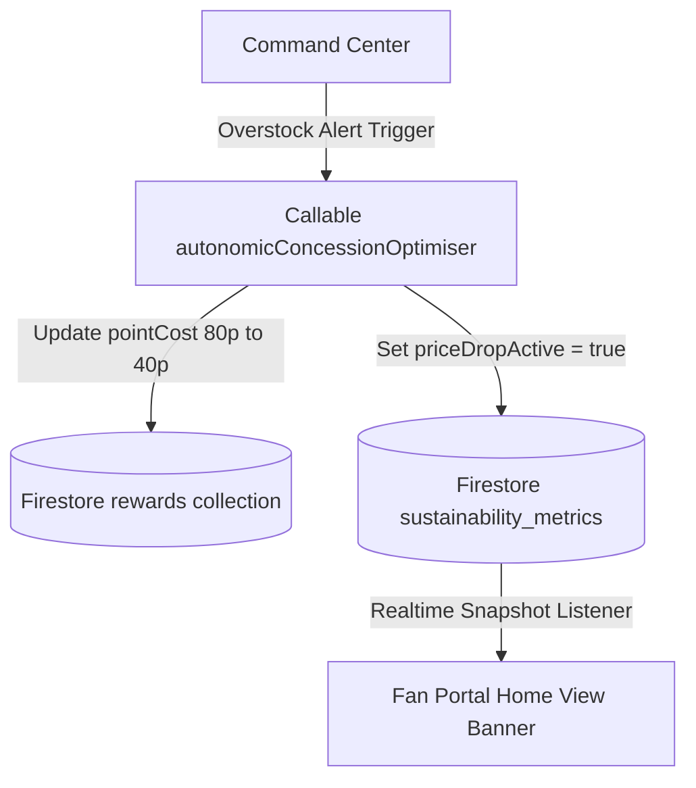
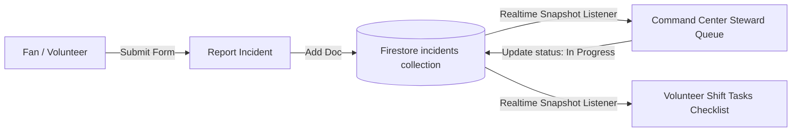

# Technical Architecture Documentation — StadiumIQ

## 1. High-Level Architecture

StadiumIQ is built as a serverless, decoupled monorepo stack. The frontends are hosted on **Vercel** and connect directly to **Google Firebase** managed backends.



---

## 2. Folder Structure

```text
promptwar/
├── apps/
│   ├── command-center/         # Next.js 14 Operations Dashboard
│   ├── fan-app/                # Vite React Fan PWA
│   └── volunteer-portal/       # Vite React Volunteer Portal
├── packages/
│   ├── tsconfig/               # Shared tsconfig Presets
│   └── eslint-config/          # Shared ESLint Presets
├── functions/                  # Serverless Node backend handlers
├── firebase.json               # Emulators and functions declarations
├── firestore.rules             # Collection rules
└── storage.rules               # Asset storage security
```

---

## 3. Database Design & Firestore Collections

StadiumIQ implements a flat, serverless NoSQL storage model optimized for dynamic real-time query scaling.

* **`users`**: Manages authenticated profile contexts.
  * Schema: `{ email: string, fullName: string, role: "fan"|"volunteer"|"fifa_admin", preferredLang: string, accessibilityNeeds: { wheelchairRequired: boolean }, dietaryPrefs: string[], createdAt: Timestamp }`
* **`venues`**: Stadium metadata and geospatial references.
  * Schema: `{ name: string, city: string, country: string, capacity: number, latitude: number, longitude: number, createdAt: Timestamp }`
* **`matches`**: Game schedules and active attendance ratios.
  * Schema: `{ venueId: string, homeTeam: string, awayTeam: string, kickoffTime: string, status: "scheduled"|"live"|"completed", attendance: number|null, createdAt: Timestamp }`
* **`tickets`**: Gate security tokens and access mappings.
  * Schema: `{ fanId: string, matchId: string, seatSection: string, seatRow: string, seatNumber: string, gate: string, qrCode: string, isAccessible: boolean, isUsed: boolean, usedAt: Timestamp|null, createdAt: Timestamp }`
* **`incidents`**: Central dispatcher logs reported by fans/volunteers.
  * Schema: `{ description: string, category: string, severity: "low"|"medium"|"high"|"critical", status: "active"|"resolved", zone: string, reportedBy: string, createdAt: string, updatedAt: string }`
* **`leaderboards`**: Standings tracking eco activities and rewards points.
  * Schema: `{ userId: string, userName: string, xpPoints: number, ecoPoints: number, updatedAt: Timestamp }`
* **`rewards`**: Redeemable concession items store inventory.
  * Schema: `{ title: string, description: string, pointCost: number, stock: number, code: string, createdAt: Timestamp }`
* **`sustainability_metrics`**: Aggregated carbon offsets and dynamic states.
  * Schema: `{ priceDropActive: boolean, message: string, updatedAt: Timestamp }`

---

## 4. Authentication Flow

```mermaid
sequenceClient -> Server (Firebase Auth)
  Client ->> Auth: SignIn(Email, Password)
  Auth -->> Client: Return JWT session token
  Client ->> Firestore: Read/Write with context.auth
```

---

## 5. State Management & Component Hierarchy

- **State Management**: Uses standard React `useState`, `useReducer`, and `useContext` hooks. Context listeners hook into Firestore paths (`useIncidents`, `useEcoPoints`, `useWebSocket`) for automatic client-side updates.
- **Component Hierarchies**:
  - Fan App: `App` -> `MainTabs` -> [`EcoEarnTab` | `NavigationTab` | `AssistantTab` | `TicketTab`].
  - Volunteer Portal: `VolunteerPortal` -> [`IncidentForm` | `TaskChecklist` | `BriefingPanel`].
  - Command Center: `page.tsx` -> [`MetricsOverview` | `SurgeForecast` | `PricingConsole`].

---

## 6. Spatial Path & BLE Positioning Equations

StadiumIQ calculates 2D real-time coordinate positions using Bluetooth Low Energy (BLE) RSSI telemetry.

### A. Log-Distance Path Loss Model
Distance ($d$) from a beacon is estimated using the RSSI (Received Signal Strength Indicator):

$$d = 10^{\frac{P_{\text{tx}} - \text{RSSI}}{10 \cdot n}}$$

In the client path solver, the calibrated transmitter power reference ($P_{\text{tx}}$ at 1 meter) is set to $-30\text{ dBm}$ and the path loss exponent ($n$) is set to $2.0$:

$$d = 10^{\frac{-30 - \text{RSSI}}{20}}$$

### B. 2D Trilateration Equations
To estimate the coordinate $P(x, y)$ from three beacon reference points $B_1(x_1, y_1)$, $B_2(x_2, y_2)$, and $B_3(x_3, y_3)$ with calculated distance radii $d_1$, $d_2$, and $d_3$:

$$(x - x_1)^2 + (y - y_1)^2 = d_1^2$$
$$(x - x_2)^2 + (y - y_2)^2 = d_2^2$$
$$(x - x_3)^2 + (y - y_3)^2 = d_3^2$$

Subtracting the third equation from the first and second linearizes the circles into two lines (intersection chord vectors):

$$2(x_3 - x_1)x + 2(y_3 - y_1)y = d_1^2 - d_3^2 - x_1^2 + x_3^2 - y_1^2 + y_3^2$$
$$2(x_3 - x_2)x + 2(y_3 - y_2)y = d_2^2 - d_3^2 - x_2^2 + x_3^2 - y_2^2 + y_3^2$$

Represented as a linear system $Ax + By = C$ and $Dx + Ey = F$:

$$\begin{bmatrix} A_c & B_c \\ D_c & E_c \end{bmatrix} \begin{bmatrix} x \\ y \end{bmatrix} = \begin{bmatrix} C_c \\ F_c \end{bmatrix}$$

Where:
* $A_c = 2(x_3 - x_1)$
* $B_c = 2(y_3 - y_1)$
* $C_c = d_1^2 - d_3^2 - x_1^2 + x_3^2 - y_1^2 + y_3^2$
* $D_c = 2(x_3 - x_2)$
* $E_c = 2(y_3 - y_2)$
* $F_c = d_2^2 - d_3^2 - x_2^2 + x_3^2 - y_2^2 + y_3^2$

The coordinate $P(x, y)$ is found using Cramer's Rule determinants:

$$\text{det} = A_c E_c - B_c D_c$$
$$x = \frac{C_c E_c - B_c F_c}{\text{det}}$$
$$y = \frac{A_c F_c - C_c D_c}{\text{det}}$$

---

## 7. Operational Workflow Topologies

### A. Serverless AI Concierge Workflow


### B. Sustainability & Rewards Ecosystem


### C. Concession Price-Drop Workflow (Autonomic Concession Optimizer)


### D. Incident Dispatch Workflow

