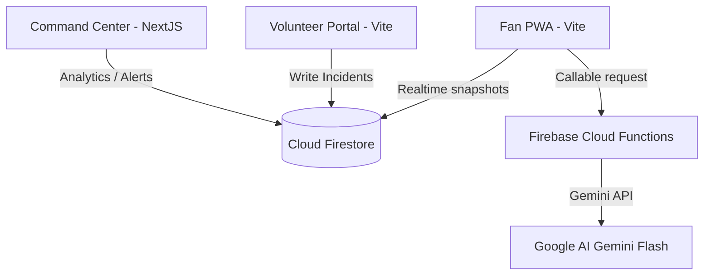

# Technical Architecture Documentation — StadiumIQ

## 1. High-Level Architecture
StadiumIQ is built as a serverless, decoupled monorepo stack. The frontends are hosted on **Vercel** and connect directly to **Google Firebase** managed backends.



---

## 2. Folder Structure

```text
promptwar/
├── apps/
│   ├── command-center/         # Next.js 14 Operations Dashboard
│   ├── fan-app/                # Vite React Fan PWA
│   └── volunteer-portal/       # Vite React Volunteer Portal
├── packages/
│   ├── tsconfig/               # Shared tsconfig Presets
│   └── eslint-config/          # Shared ESLint Presets
├── functions/                  # Serverless Node backend handlers
├── firebase.json               # Emulators and functions declarations
├── firestore.rules             # Collection rules
└── storage.rules               # Asset storage security
```

---

## 3. Database Design & Firestore Collections

* **`users`**: Auth account details.
* **`venues`**: Match stadium geographical coordinates.
* **`matches`**: Kickoff schedules and attendances.
* **`tickets`**: Gate section and barcode values.
* **`incidents`**: Location, severity, reported status.
* **`leaderboards`**: User points, transactions log, badges.
* **`rewards`**: Redeemable concessions store inventory.

---

## 4. Authentication Flow
```mermaid
sequenceClient -> Server (Firebase Auth)
  Client ->> Auth: SignIn(Email, Password)
  Auth -->> Client: Return JWT session token
  Client ->> Firestore: Read/Write with context.auth
```

---

## 5. State Management & Component Hierarchy
* **State Management**: Uses standard React `useState`, `useReducer`, and `useContext` hooks. Context listeners hook into Firestore paths (`useIncidents`, `useEcoPoints`, `useWebSocket`) for automatic client-side updates.
* **Component Hierarchies**:
  - Fan App: `App` -> `MainTabs` -> [`EcoEarnTab` | `NavigationTab` | `AssistantTab` | `TicketTab`].
  - Volunteer Portal: `VolunteerPortal` -> [`IncidentForm` | `TaskChecklist` | `BriefingPanel`].
  - Command Center: `page.tsx` -> [`MetricsOverview` | `SurgeForecast` | `PricingConsole`].
