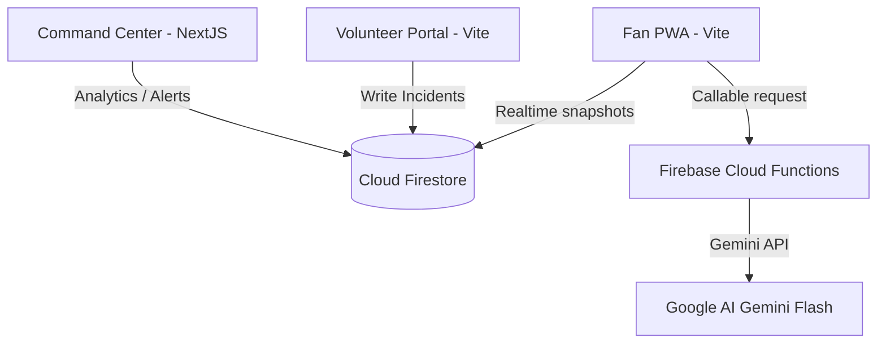

# Technical Architecture & Deployment Documentation — StadiumIQ

## 🏗️ High-Level Architecture

StadiumIQ is built as a serverless, decoupled monorepo stack. The three frontends (Fan Portal, Volunteer Portal, Command Center) are hosted on **Vercel** and connect directly to **Google Firebase** managed backends.



---

## 🛠️ Monorepo Workspaces Layout

```text
promptwar/
├── apps/
│   ├── command-center/         # Next.js 14 Operations Console
│   ├── fan-app/                # Vite React Fan PWA
│   └── volunteer-portal/       # Vite React Volunteer portal
├── packages/
│   ├── tsconfig/               # Shared tsconfig configurations
│   └── eslint-config/          # Shared ESLint rule configurations
├── functions/                  # Firebase Cloud Functions (Node/TS)
├── firebase.json               # Firebase project configuration
├── firestore.rules             # Database read/write access policies
└── storage.rules               # Storage bucket permissions
```

---

## 🚀 Deployment Overview

- **Hosting**: Vercel (Hobby Free Tier)
- **Backend**: Google Firebase Spark (Free Tier)
- **AI Engine**: Google AI Studio (Free Gemini API Key)

For detailed step-by-step instructions, see the following guides:

- **[DEPLOYMENT_GUIDE.md](./DEPLOYMENT_GUIDE.md)**: Beginner step-by-step credentials and deployment guides.
- **[VERCEL_SETUP.md](./VERCEL_SETUP.md)**: Vercel monorepo configuration instructions.
- **[FIREBASE_SETUP.md](./FIREBASE_SETUP.md)**: Detailed Firebase service definitions and configuration rules.
