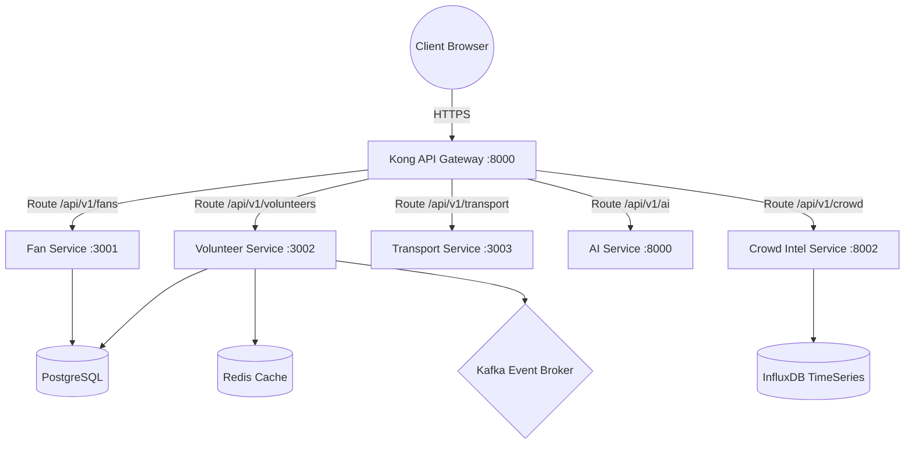

# StadiumIQ Unified Deployment Manual

This guide provides a comprehensive overview of the deployment topology, architecture, and orchestration workflows required to run the StadiumIQ operations platform in production.

---

## 🏗️ Architecture Overview

The StadiumIQ system consists of a microservices backend routed via an API gateway, with separate role-based frontend web applications:

---

## 🌐 Environments & Services

| Component | Target Runtime | Port | Internal Name |
| :--- | :--- | :--- | :--- |
| **Kong API Gateway** | Docker Compose | 8000 | `stadiumiq-gateway` |
| **Fan Service** | Docker Compose | 3001 | `stadiumiq-fan-service` |
| **Volunteer Service** | Docker Compose | 3002 | `stadiumiq-volunteer-service` |
| **Transport Service** | Docker Compose | 3003 | `stadiumiq-transport-service` |
| **AI Service** | Docker Compose | 8000 | `stadiumiq-ai-service` |
| **Crowd Intel Service** | Docker Compose | 8002 | `stadiumiq-crowd-intel-service` |
| **PostgreSQL DB** | Docker Compose | 5432 | `stadiumiq-postgres` |
| **Redis Cache** | Docker Compose | 6379 | `stadiumiq-redis` |
| **Kafka Broker** | Docker Compose | 9092 | `stadiumiq-kafka` |
| **InfluxDB** | Docker Compose | 8086 | `stadiumiq-influx` |
| **OpenSearch** | Docker Compose | 9200 | `stadiumiq-opensearch` |
| **MinIO Storage** | Docker Compose | 9000 | `stadiumiq-minio` |
| **Fan Portal Web App** | Vercel Serverless | HTTPS | `@stadiumiq/fan-app` |
| **Volunteer Portal Web App** | Vercel Serverless | HTTPS | `@stadiumiq/volunteer-portal` |
| **Command Center Dashboard** | Vercel Serverless | HTTPS | `@stadiumiq/command-center` |

---

## ⚡ Deployment Lifecycle

1. **Infrastructure Provisioning**: Run setup scripts in Oracle Cloud.
2. **Configuration Settings**: Configure environment variables, secrets, and SSL.
3. **Database Bootstrap**: Run migrations and seed data automatically on startup.
4. **Build & Build validation**: Run lint, typechecks, and tests via CI.
5. **Gateway Setup**: Start Kong and apply routing rules.
6. **Frontend Publishing**: Build and deploy Vite and NextJS apps on Vercel.
7. **Verification**: Run pre-flight health validations.

For detailed steps of each component, consult the following manuals:
- **VM Configuration**: [ORACLE_CLOUD_SETUP.md](ORACLE_CLOUD_SETUP.md)
- **Backend Deployment**: [BACKEND_DEPLOYMENT.md](BACKEND_DEPLOYMENT.md)
- **Frontend Deployment**: [VERCEL_DEPLOYMENT.md](VERCEL_DEPLOYMENT.md) / [FRONTEND_DEPLOYMENT.md](FRONTEND_DEPLOYMENT.md)
- **Parameter hardlinks**: [ENVIRONMENT_VARIABLES.md](ENVIRONMENT_VARIABLES.md)
- **Auditing checklist**: [PRODUCTION_CHECKLIST.md](PRODUCTION_CHECKLIST.md)
- **Hardening and Security**: [SECURITY_GUIDE.md](SECURITY_GUIDE.md)
- **Test execution**: [TESTING_GUIDE.md](TESTING_GUIDE.md)
- **REST Endpoints**: [API_DOCUMENTATION.md](API_DOCUMENTATION.md)
